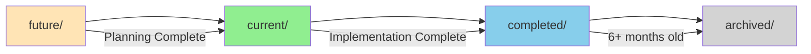

# Feature Lifecycle Management

## Overview
Every feature in RegAssist follows a predictable lifecycle with automatic transitions and documentation requirements at each stage.

## Lifecycle Stages



## Directory Structure

```
documents/
├── future/          # Ideas and early planning
├── current/         # Active development
├── completed/       # Finished features
├── archived/        # Old completed features
└── templates/       # Documentation templates
```

## Stage Definitions

### 1. Future Stage (`future/`)

**Purpose**: Early planning, ideas, research

**When Features Enter**:
- User mentions future idea
- Long-term planning discussed
- Research needed before implementation
- Blocked by dependencies

**Required Documentation**:
```
future/{feature_name}/
├── README.md              # Idea description
├── research/              # Optional research notes
└── planning/
    └── concept.md         # Initial concept
```

**Automatic Triggers**:
- User says "future", "someday", "eventually"
- User says "research this", "explore"
- Dependency not ready

**Exit Criteria**:
- Requirements clear
- Dependencies resolved
- User ready to implement
- Planning complete

### 2. Current Stage (`current/`)

**Purpose**: Active development

**When Features Enter**:
- Planning complete
- User says "implement", "build now"
- Moved from future/
- New feature with immediate need

**Required Documentation**:
```
current/{feature_name}/
├── README.md                    # Full overview
├── CURRENT_STATE.md            # Living document (REQUIRED)
├── planning/
│   ├── requirements.md
│   └── IMPLEMENTATION_PLAN.md
├── architecture/               # If COMPLEX
├── guides/                     # Usage guides
├── output/                     # If needs approval
└── sessions/                   # Work history
```

**CURRENT_STATE.md Requirements**:
- Must have "🔴 NEXT SESSION START HERE"
- Must track what works ✅
- Must track what doesn't ❌
- Must have clear next steps
- Updated EVERY session

**Automatic Triggers**:
- User starts implementation
- Feature unblocked
- Dependencies ready
- Approval received

**Exit Criteria**:
- All tests pass
- Documentation complete
- User confirms done
- No remaining TODOs

### 3. Completed Stage (`completed/`)

**Purpose**: Finished features, reference documentation

**When Features Enter**:
- Implementation complete
- All tests passing
- Documentation finalized
- User confirms completion

**Required Documentation**:
```
completed/{feature_name}/
├── README.md                    # Final overview
├── FINAL_STATE.md              # Replaces CURRENT_STATE.md
├── architecture/               # Final architecture
├── guides/                     # User guides
├── sessions/                   # Complete history
└── metrics/
    └── summary.md              # Performance, stats
```

**Automatic Triggers**:
- User says "done", "complete", "finished"
- All TODOs checked
- Final checkpoint created
- Tests passing

**Documentation Changes**:
- CURRENT_STATE.md → FINAL_STATE.md
- Add completion metrics
- Archive decision: immediate or after 6 months

### 4. Archived Stage (`archived/`)

**Purpose**: Historical reference, rarely accessed

**When Features Enter**:
- 6+ months in completed/
- Deprecated features
- Replaced by new version

**Documentation**:
- Compressed/minimal
- Historical reference only
- May be moved to cold storage

## Automatic Transitions

### Future → Current
```python
def should_move_to_current(feature):
    return any([
        user_says("implement {feature}"),
        user_says("let's build {feature}"),
        planning_complete(feature),
        dependencies_ready(feature),
        approval_received(feature)
    ])

# ACTION:
1. Move directory from future/ to current/
2. Create CURRENT_STATE.md
3. Enhance documentation structure
4. Create session 001
5. Update ACTIVE_FEATURES.md
6. Commit with message: "feat({feature}): promote to active development"
```

### Current → Completed
```python
def should_move_to_completed(feature):
    return all([
        tests_passing(feature),
        documentation_complete(feature),
        no_remaining_todos(feature),
        user_confirms_complete(feature)
    ])

# ACTION:
1. Create final checkpoint
2. Convert CURRENT_STATE.md to FINAL_STATE.md
3. Add completion metrics
4. Move directory to completed/
5. Update ACTIVE_FEATURES.md
6. Commit with message: "feat({feature}): mark as complete"
```

### Completed → Archived
```python
def should_archive(feature):
    return any([
        months_since_completion(feature) > 6,
        feature_deprecated(feature),
        replaced_by_newer(feature)
    ])

# ACTION:
1. Compress documentation
2. Move to archived/
3. Update index
4. Commit with message: "chore({feature}): archive old feature"
```

## Status Tracking

### ACTIVE_FEATURES.md Format
```markdown
## Current Features (Active Development)

### 1. {Feature Name} 🟢 ACTIVE
- **Location**: current/{feature_name}/
- **Status**: {Planning|Implementing|Testing}
- **Sessions**: {count}
- **Started**: {date}
- **Target**: {date}

### 2. {Feature Name} 🟡 BLOCKED
- **Location**: current/{feature_name}/
- **Status**: Blocked by {dependency}
- **Sessions**: {count}
- **Blocker**: {description}

## Future Features (Planned)

### 1. {Feature Name} 📋 PLANNED
- **Location**: future/{feature_name}/
- **Priority**: {High|Medium|Low}
- **Dependencies**: {list}
- **Estimated Start**: {date}

## Recently Completed

### 1. {Feature Name} ✅ COMPLETE
- **Location**: completed/{feature_name}/
- **Completed**: {date}
- **Sessions**: {total}
- **LOC**: {count}
```

## Lifecycle Automation Rules

### On Session Start
```python
1. Detect feature stage from directory location
2. Apply stage-appropriate rules
3. Check for transition conditions
4. Load appropriate documentation
```

### During Development
```python
# Continuously check:
- Should feature transition stages?
- Is documentation current?
- Are dependencies still met?
- Is feature blocked?
```

### On Session End
```python
1. Check if feature should transition
2. Update stage-appropriate documentation
3. Commit changes
4. Update ACTIVE_FEATURES.md
```

## Feature Promotion Rules

### Quality Gates for Promotion

**Future → Current Requirements**:
- [ ] Clear problem statement
- [ ] Defined solution approach
- [ ] No blocking dependencies
- [ ] User ready to implement

**Current → Completed Requirements**:
- [ ] All code implemented
- [ ] Tests written and passing
- [ ] Documentation complete
- [ ] Guides created
- [ ] No open TODOs
- [ ] User approval

## Backward Transitions

### Current → Future (Deprioritized)
```python
# When feature gets blocked or deprioritized
1. Document reason in CURRENT_STATE.md
2. Move to future/ with explanation
3. Preserve all work done
4. Update ACTIVE_FEATURES.md
```

### Completed → Current (Bug/Enhancement)
```python
# When completed feature needs work
1. Copy from completed/ to current/
2. Convert FINAL_STATE.md to CURRENT_STATE.md
3. Create new session series (continuing numbers)
4. Document reason for reactivation
```

## Best Practices

### DO
- ✅ Keep features in appropriate stage
- ✅ Transition promptly when conditions met
- ✅ Maintain stage-appropriate documentation
- ✅ Use automatic triggers
- ✅ Track metrics at completion

### DON'T
- ❌ Skip stages (future → completed)
- ❌ Leave stale features in current/
- ❌ Forget to update ACTIVE_FEATURES.md
- ❌ Mix active and inactive in current/
- ❌ Delete instead of archiving

## Metrics to Track

### Per Feature
- Time in each stage
- Number of sessions
- Lines of code/documentation
- Number of transitions
- Blocking time

### Overall
- Features per stage
- Average time to completion
- Abandonment rate
- Reactivation rate
- Documentation completeness

---

*Features should flow naturally through stages. Claude should manage transitions automatically.*